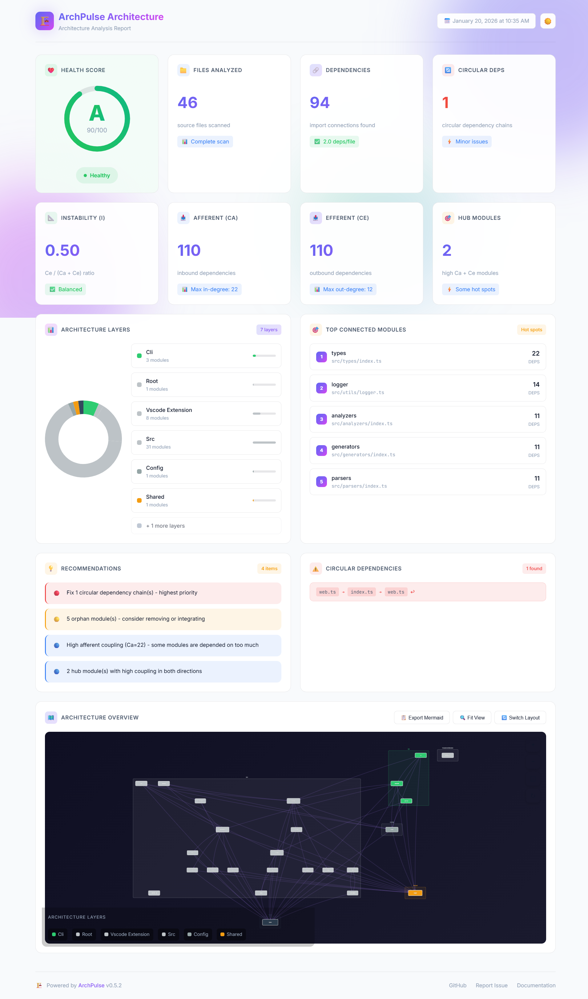
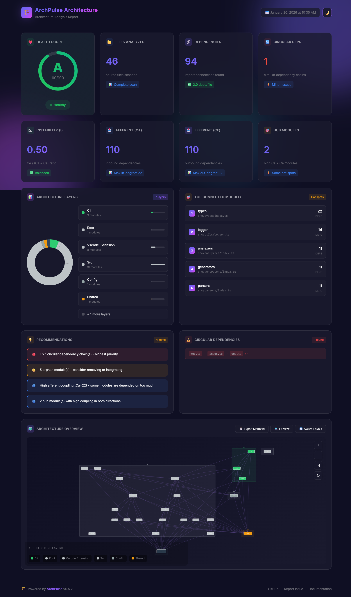

<div align="center">

# 🏗️ ArchPulse

### Living Architecture Diagrams for Modern Codebases

[](https://www.npmjs.com/package/archpulse)
[](https://opensource.org/licenses/MIT)
[](https://github.com/ThanhNguyxn/ArchPulse/actions)
[](https://github.com/ThanhNguyxn/ArchPulse/stargazers)

**Stop manually drawing architecture diagrams that get outdated in a week.**

[Quick Start](#-quick-start) •
[Features](#-features) •
[Installation](#-installation) •
[Configuration](#-configuration) •
[Roadmap](#-roadmap) •
[Contributing](#-contributing)

</div>

---

## 💖 Support the Project

If you find ArchPulse helpful, consider supporting its development:

<p align="center">
  <a href="https://github.com/sponsors/ThanhNguyxn">
    
  </a>
  <a href="https://buymeacoffee.com/thanhnguyxn">
    
  </a>
</p>

---

## ⚡ Quick Start

```bash
# Install globally
npm install -g archpulse

# Generate architecture diagram
archpulse generate

# ✅ docs/architecture.drawio created!
```

That's it! Open `docs/architecture.drawio` in [draw.io](https://app.diagrams.net/) to view and edit your architecture diagram.

---

## 📸 Screenshots

### Interactive Web Dashboard

<p align="center">
  
</p>

<details>
<summary><strong>🌙 Dark Mode</strong></summary>
<p align="center">
  
</p>
</details>

**Dashboard Features:**
- 📊 **Health Score Gauge** - A-F grade with percentage (Robert C. Martin metrics)
- 📈 **Instability Index** - Ce/(Ca+Ce) ratio visualization
- 🔗 **Dependency Graph** - Interactive Cytoscape.js with dagre layout
- 🎯 **Hub Detection** - Identify architectural hot spots
- 💡 **Recommendations** - Actionable improvement suggestions

---

## ✨ Features

### 🔍 Smart Code Analysis
- **Multi-language support**: JavaScript, TypeScript, Python, Java, Go
- **Dependency mapping**: Automatically detects imports, requires, and module relationships
- **Layer detection**: Identifies frontend/backend separation, MVC patterns, microservices
- **Circular dependency detection**: Catch architectural issues early

### 📊 Professional Diagrams
- **Editable output**: Native draw.io format (.drawio) - edit anytime
- **Mermaid export**: Generate text-based diagrams
- **Auto-layout**: Hierarchical layout with minimal edge crossings
- **Color-coded**: Consistent color scheme for different component types

### 🤖 GitHub Action Integration
- **Auto-updates on every PR**: Living documentation that never goes stale
- **Change highlighting**: Visual diff showing what changed
- **PR comments**: Automatic diagram preview in pull requests

### 📈 Architecture Health Metrics (Robert C. Martin)
- **Instability Index (I)**: `I = Ce/(Ca+Ce)` - Measures module volatility (0=stable, 1=unstable)
- **Afferent Coupling (Ca)**: Inbound dependencies - who depends on you
- **Efferent Coupling (Ce)**: Outbound dependencies - who you depend on
- **Hub Detection**: Identifies modules with high Ca AND Ce (architectural hot spots)
- **Circular dependency detection**: Catch architectural issues early
- **Layer violation analysis**: Ensure proper dependency direction

### 🌐 Interactive Web Dashboard
- **Health Score Gauge**: A-F grade with 0-100 score
- **Cytoscape.js Graph**: Interactive architecture visualization with zoom/pan/drag
- **Dagre Hierarchical Layout**: Clean top-to-bottom or left-to-right layout
- **Layer Grouping**: Modules grouped by architectural layer (compound nodes)
- **Export Options**: Export to Mermaid format directly from dashboard

### 🔌 VS Code Extension
- **Generate diagrams**: Right-click context menu integration
- **Live preview**: Interactive Mermaid diagram preview in editor
- **Health status bar**: Real-time architecture health score (A-F grade)
- **Auto-regeneration**: Watch mode for automatic updates on file changes

> 📥 **Install Extension**: [Open VSX](https://open-vsx.org/extension/ThanhNguyxn/archpulse-vscode) | [Download VSIX](https://github.com/ThanhNguyxn/ArchPulse/releases/latest)

---

## 📦 Installation

### CLI Installation (Recommended)
```bash
# Install globally
npm install -g archpulse

# Or use npx (no installation needed)
npx archpulse generate
```

### VS Code Extension
```bash
# Option 1: Install from Open VSX Registry
# https://open-vsx.org/extension/ThanhNguyxn/archpulse-vscode

# Option 2: Download VSIX from GitHub Releases
# https://github.com/ThanhNguyxn/ArchPulse/releases/latest
code --install-extension archpulse-vscode-*.vsix
```

### Project-level Installation
```bash
npm install --save-dev archpulse
```

---

## 🚀 Usage

### Basic Usage
```bash
# Analyze current directory
archpulse generate

# Analyze specific directory
archpulse generate ./src

# Output to custom location
archpulse generate --output ./diagrams

# Show only analysis (no diagram generation)
archpulse analyze

# Create sample config file
archpulse init
```

### CLI Commands

| Command | Description |
|---------|-------------|
| `archpulse generate [path]` | Generate architecture diagram |
| `archpulse dashboard [path]` | Generate interactive HTML dashboard |
| `archpulse analyze [path]` | Analyze codebase and show stats |
| `archpulse init` | Create sample config file |

### Output Formats

```bash
# Generate Draw.io diagram (default)
archpulse generate --format drawio

# Generate multiple formats
archpulse generate --format drawio,mermaid,c4

# Generate interactive HTML dashboard
archpulse dashboard
```

| Format | File | Description |
|--------|------|-------------|
| `drawio` | `architecture.drawio` | Editable diagram for [diagrams.net](https://app.diagrams.net/) |
| `mermaid` | `architecture.mmd` | Text-based Mermaid flowchart |
| `c4` | `architecture.c4.dsl` | C4 Model DSL for [Structurizr](https://structurizr.com/) |
| `dashboard` | `dashboard.html` | Interactive web dashboard with metrics |

### CLI Options

| Option | Description |
|--------|-------------|
| `-o, --output <dir>` | Output directory (default: `docs`) |
| `-f, --format <formats>` | Output formats: `drawio,mermaid,c4` (comma-separated) |
| `-c, --config <file>` | Path to config file |
| `-v, --verbose` | Enable verbose output |
| `-w, --watch` | Watch mode for auto-regeneration |
| `--detect-changes` | Highlight changes (for PR integration) |

### GitHub Action
Add to your `.github/workflows/archpulse.yml`:

```yaml
name: ArchPulse Auto-Update
on:
  pull_request:
    types: [opened, synchronize]

permissions:
  contents: read
  pull-requests: write

jobs:
  update-diagram:
    runs-on: ubuntu-latest
    steps:
      - uses: actions/checkout@v4
      
      - name: Generate Architecture Diagram
        uses: ThanhNguyxn/ArchPulse@main
        with:
          path: '.'
          output: 'docs'
          comment: 'true'
          fail-on-circular: 'false'
      
      - name: Upload Diagram
        uses: actions/upload-artifact@v4
        with:
          name: architecture-diagram
          path: docs/architecture.drawio
```

#### Action Inputs

| Input | Description | Default |
|-------|-------------|---------|
| `path` | Project directory to analyze | `.` |
| `output` | Output directory | `docs` |
| `config` | Path to config file | - |
| `comment` | Post PR comment | `true` |
| `fail-on-circular` | Fail on circular deps | `false` |

#### Action Outputs

| Output | Description |
|--------|-------------|
| `diagram-path` | Path to generated .drawio file |
| `files-analyzed` | Number of files analyzed |
| `circular-dependencies` | Number of circular deps |

---

## ⚙️ Configuration

Create `archpulse.config.yml` in your project root:

```yaml
# Directories to ignore
ignore:
  - node_modules/
  - dist/
  - tests/
  - "**/*.test.ts"

# Custom grouping rules
grouping:
  - pattern: "src/api/*"
    label: "REST API Layer"
    color: "#2ecc71"
  - pattern: "src/db/*"
    label: "Data Layer"
    color: "#9b59b6"
  - pattern: "src/ui/*"
    label: "Frontend"
    color: "#3498db"

# Output options
output:
  directory: docs/
  filename: architecture
  formats:
    - drawio
    - mermaid

# Styling
styles:
  frontend: "#3498db"
  backend: "#2ecc71"
  database: "#9b59b6"
  external: "#95a5a6"
```

---

## 🎯 Roadmap

### Phase 1: Core Engine ✅
- [x] Project setup & TypeScript configuration
- [x] JavaScript/TypeScript parser (Babel AST)
- [x] Python parser (regex-based)
- [x] Dependency graph builder
- [x] Circular dependency detection
- [x] Layer detection algorithm
- [x] Draw.io XML generator
- [x] Mermaid diagram generator
- [x] Hierarchical layout engine
- [x] CLI interface (`generate`, `analyze`, `init`)
- [x] Configuration system (YAML)

### Phase 2: GitHub Integration ✅
- [x] GitHub Action
- [x] PR comments with diagram preview
- [x] Change detection and highlighting
- [x] PNG export (via Playwright)
- [x] SVG export (via Playwright)

### Phase 3: Advanced Features ✅
- [x] Health dashboard with score/recommendations
- [x] Multi-language support (Java, Go)
- [x] Watch mode for auto-regeneration
- [x] Robert C. Martin package metrics (Ca, Ce, Instability)
- [x] Interactive web dashboard with Cytoscape.js
- [x] Dagre hierarchical layout for diagrams
- [ ] AI-powered architecture insights (optional, coming soon)

### Phase 4: Ecosystem ✅
- [x] VS Code extension
- [x] Web dashboard
- [x] C4 model export

---

## 🤝 Contributing

We love contributions! See [CONTRIBUTING.md](CONTRIBUTING.md) for guidelines.

```bash
# Clone the repo
git clone https://github.com/ThanhNguyxn/ArchPulse.git
cd ArchPulse

# Install dependencies
npm install

# Build
npm run build

# Run in development mode
npm run dev

# Run tests
npm test
```

---

## 📄 License

MIT © [ThanhNguyxn](https://github.com/ThanhNguyxn)

---

<div align="center">

**⭐ Star us on GitHub — it helps!**

[Report Bug](https://github.com/ThanhNguyxn/ArchPulse/issues) •
[Request Feature](https://github.com/ThanhNguyxn/ArchPulse/issues)

<br>

**💖 Support Development**

<a href="https://github.com/sponsors/ThanhNguyxn">GitHub Sponsors</a> •
<a href="https://buymeacoffee.com/thanhnguyxn">Buy Me a Coffee</a>

</div>

